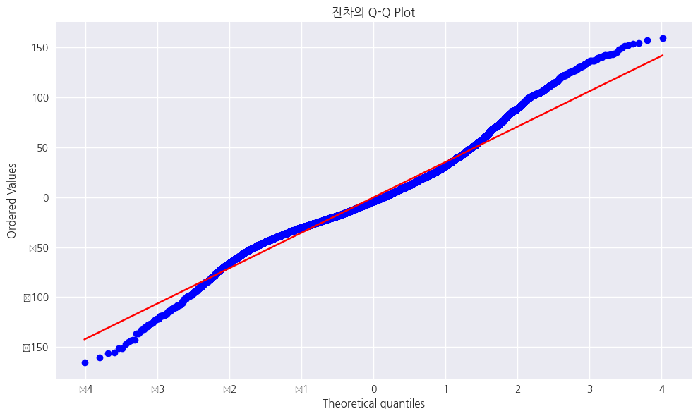

## 마지막 업데이트
24.12.06

 

## 작성자
60191652 문장훈

 

## Regression Analysis (개선 1차)

1. 날짜 관련 특성 추가
    - reservation_status_date를 datetime으로 변환
    - 년, 월, 일, 요일, 분기 특성 생성
    - arrival_date 생성 및 days_until_arrival 계산

2. 제거되는 컬럼 변경
    - arrival_date와 관련된 컬럼들 추가 제거

3. 이상치 처리 방식 변경
    - IQR 방법 함수 추가
    - ADR에만 IQR 방법 적용
    - 나머지 수치형 변수는 캡핑 처리
    - 처리 전후 데이터 크기 출력 추가

 

#### 모델 성능 비교

|-|MSE|RMSE|R-squared|
|---|---|---|---|
|Before|2775.6395|52.6843|0.2066|
|After|1289.9266|35.9155|0.3323|

|Before|After|
|---|---|
|||
