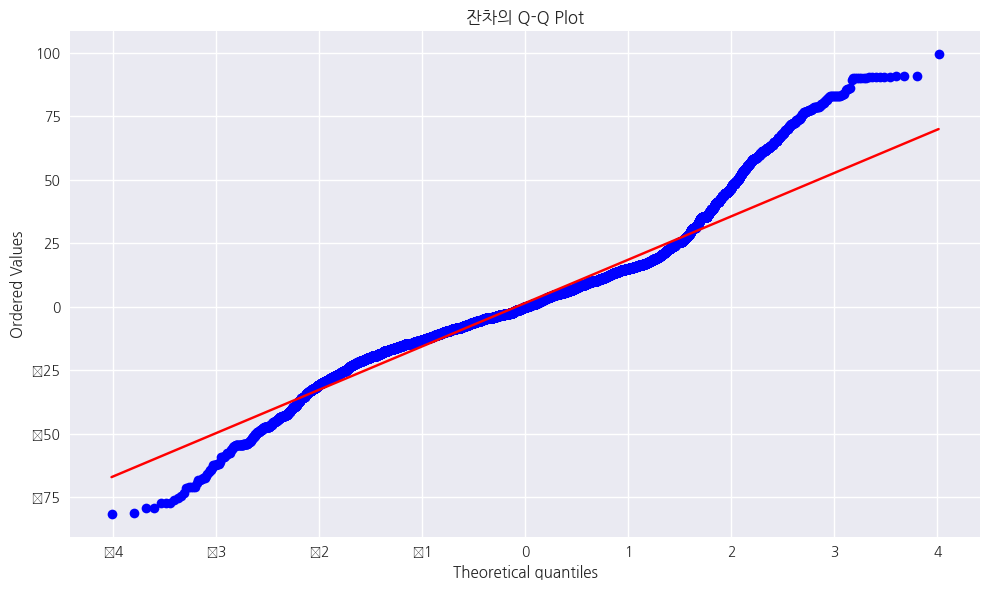

## 마지막 업데이트
24.12.07

 

## 작성자
60191652 문장훈

 

## Regression Analysis (개선 1차)

1. 결측치 처리 개선
    - 결측치 개수 확인 코드 추가
    - ADR 0값과 NaN 값 모두 제거하도록 변경
    - 범주형/수치형 변수 구분하여 결측치 처리
        - 범주형: 최빈값으로 대체
        - 수치형: 중앙값으로 대체

2. ADR 변환 및 세분화
    - log_adr 컬럼 추가 (np.log1p 사용)
    - adr_segment 컬럼 추가 (low, medium, high 3구간)
    - 구간별 독립적인 모델 학습 구조로 변경

3. 모델링 방식 개선
    - 구간별 개별 모델 학습 함수(train_segment_model) 구현
    - 특성 선택 방식 개선
        - 누적 중요도 80% 기준으로 특성 선택
        - 최소 5개 특성 유지하도록 설정
    - 가중 회귀 모델(WLS) 도입
        - 초기 OLS 모델의 잔차 기반 가중치 계산
        - 가중치 적용한 WLS 모델 학습

4. 평가 방식 개선
    - 구간별 모델 통합 평가 함수(evaluate_segment_models) 구현
    - 예측값 역변환 처리 추가 (np.expm1)
    - 전체 구간에 대한 통합 성능 지표 계산

5. PCA 관련 기능 제거
    - 차원 축소 단계 제거
    - 설명된 분산 비율 분석 제거

6. 시각화 간소화
    - ADR 분포 시각화 제거
    - 잔차 vs 예측값 산점도 제거
    - 기본적인 성능 평가 시각화만 유지

 

#### 모델 성능 비교

|-|MSE|RMSE|R-squared|
|---|---|---|---|
|Before|1289.9266|35.9155|0.3323|
|After|311.7956|17.6577|0.8204|

|Before|After|
|---|---|
|||

### 개선 필요

#### 학습 데이터에 대한 Adj. R-squared
|Low|Medium|High|
|---|---|---|
|0.963|0.336|0.811|

=> Medium 구간에 비교적 낮은 성능을 보임 